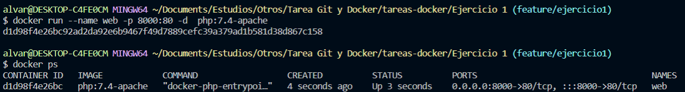
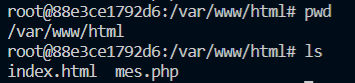
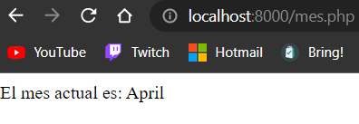
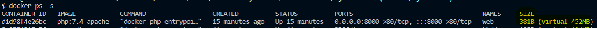
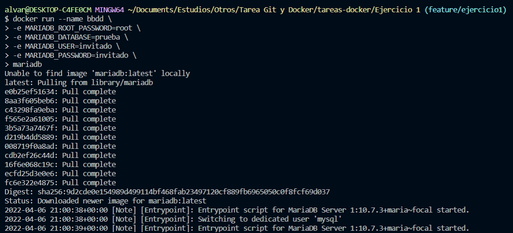
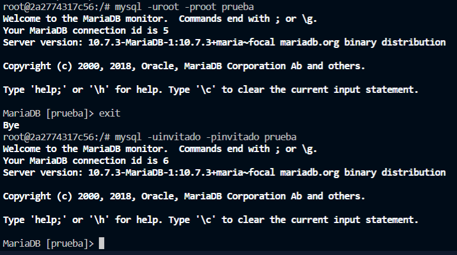

# Ejercicio 1
## Web
#### 1.- Arrancamos el contenedor de apache con php

```
docker run --name web -p 8000:80 -d  php:7.4-apache
```

#### 2.- Comprobamos que se levanta el contenedor.

```
docker ps
```



#### 3.- Copiamos el contenido web a /var/www/html

```
docker cp web/. web:/var/www/html
```

#### 4.- Comprobamos que se ha subido el contenido a la máquina







## Database
#### 1.- Arrancamos el contenedor de mariadb con sus variables de entorno.

```
docker run --name bbdd \
-e MARIADB_ROOT_PASSWORD=root \
-e MARIADB_DATABASE=prueba \
-e MARIADB_USER=invitado \
-e MARIADB_PASSWORD=invitado \
mariadb
```



#### 2.- Comprobamos que se ha creado correctamente.

