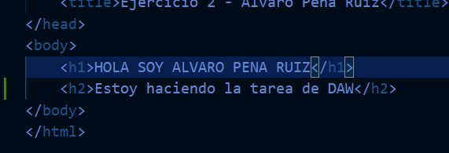
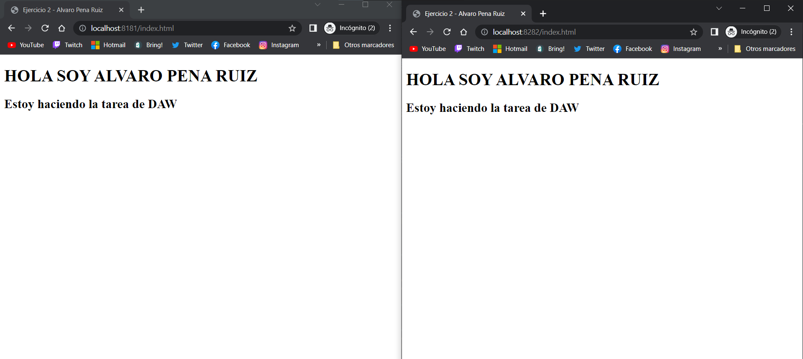
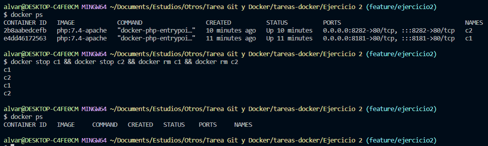

# Ejercicio 2
#### 1.- Arrancamos los contenedores con los parámetros especificados en la tarea

```
docker run --name c1 -p 8181:80 --mount type=bind,source=/c/Users/alvar/Documents/Estudios/Otros/Tarea\ Git\ y\ Docker/tareas-docker/Ejercicio\ 2/saludo,destination=/var/www/html -d  php:7.4-apache
docker run --name c2 -p 8282:80 --mount type=bind,source=/c/Users/alvar/Documents/Estudios/Otros/Tarea\ Git\ y\ Docker/tareas-docker/Ejercicio\ 2/saludo,destination=/var/www/html -d  php:7.4-apache
```


#### 2.- Comprobamos que se resuelven a traves del navegador.


#### 3.- Modifico el index.html.



#### 4.- Refresco los navegadores.



#### 5.- Borramos los contenedores.

```
docker stop c1 && docker stop c2 && docker rm c1 && docker rm c2
```



