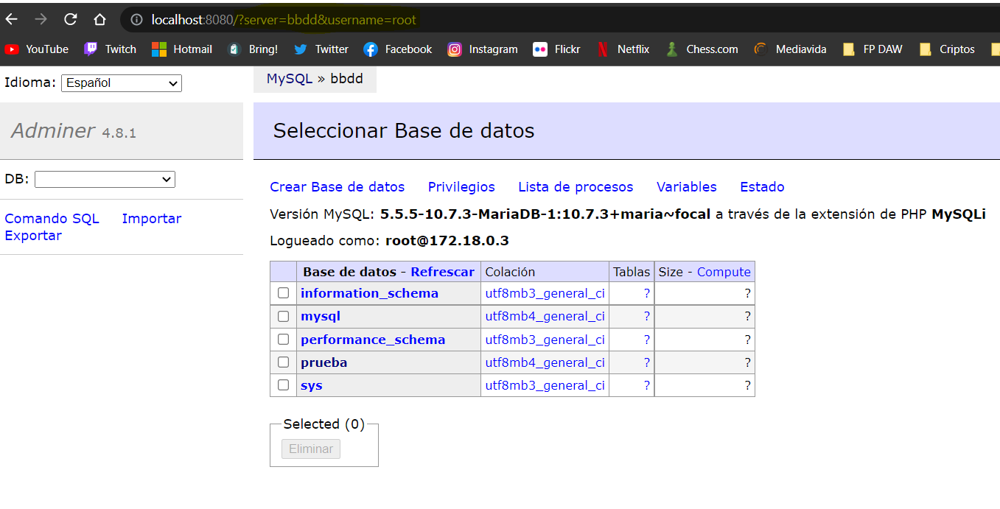

# Ejercicio 2
#### 1.- Creamos la red tipo bridge (red por defecto).

```
docker network create redbd
```


#### 2.- Creamos la db con la red redbd y el volumen persistente (aunque la imagen crea uno por defecto).

```
docker run -d --name bbdd \
-e MARIADB_ROOT_PASSWORD=root \
-e MARIADB_DATABASE=prueba \
--network redbd \
-p 3306:3306 \
-v volumen_persistente:/backup \
mariadb
```


#### 3.- Creamos el contenedor adminer para conectar a la bbdd.

```
docker run -p 8080:8080 --network redbd -d --name web adminer
```


#### 4.- Nos conectamos a la bbdd via web.



### Extra
#### Creamos una bbdd via web.


#### Consulta en modo texto a la bbdd desde la web.


#### Comprobacion de los recursos corriendo.

```
docker ps
docker volume ls
docker network ls
```


#### Eliminacion de todos los recursos

```
docker stop bbdd
docker stop web
docker rm web
docker rm bbdd
docker network prune
docker volume prune
```

