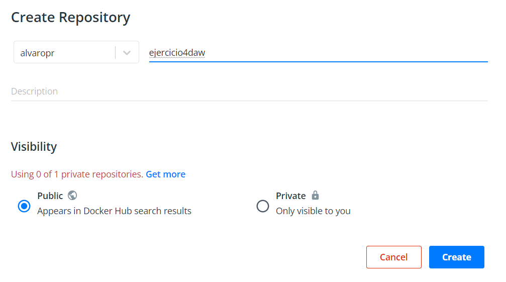

# Ejercicio 4
## Dockerfile
#### 1.- Creamos el contexto con un Dockerfile y una carpeta con la web de ejemplo.


#### 2.- Construimos la imagen.

```
docker build -t alvaropr/ejercicio4daw:v1 .
```


#### 3.- Lanzamos el contenedor.

```
docker run -d -p 80:80 --name ejercicio4 alvaropr/ejercicio4daw:v1
```


#### 4.- Comprobamos en el navegador.


#### 5.- En mi caso creo un repositorio en mi cuenta de DockerHub.




#### 6.- Pusheo la imagen.

```
docker push alvaropr/ejercicio4daw:v1
```


#### 7.- Comprobamos que esta en DockerHub y que si la borramos en local, luego se descarga perfectamente.


```
docker stop ejercicio4
docker rm ejercicio4
docker rmi alvaropr/ejercicio4daw:v1
docker pull alvaropr/ejercicio4daw:v1
```


